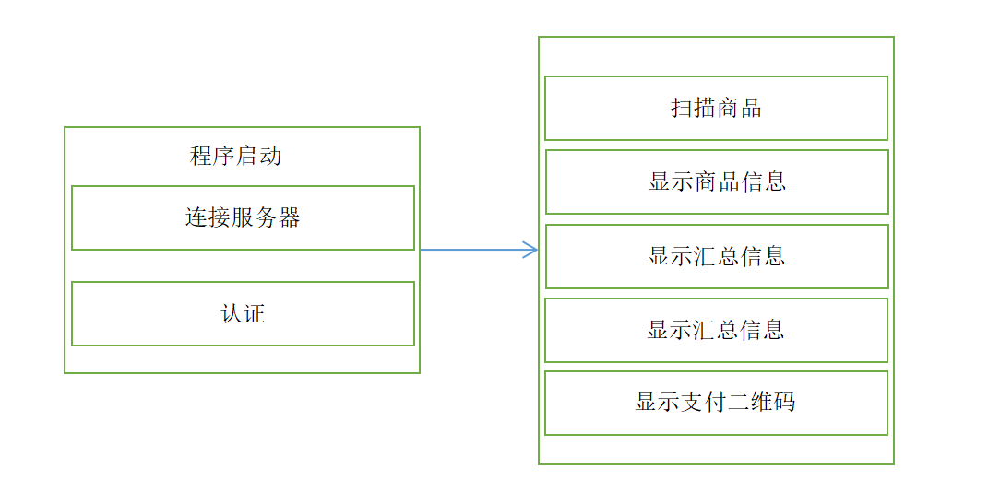
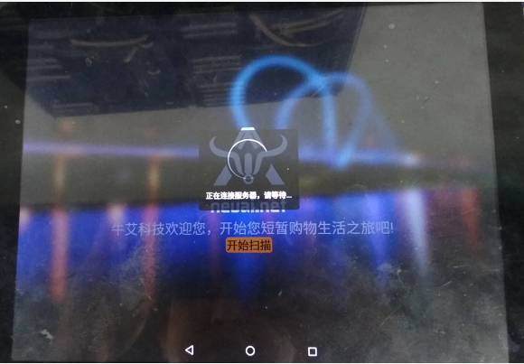
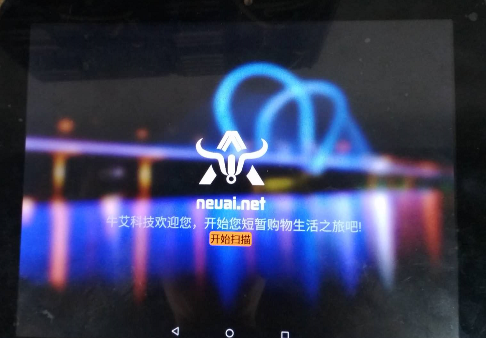
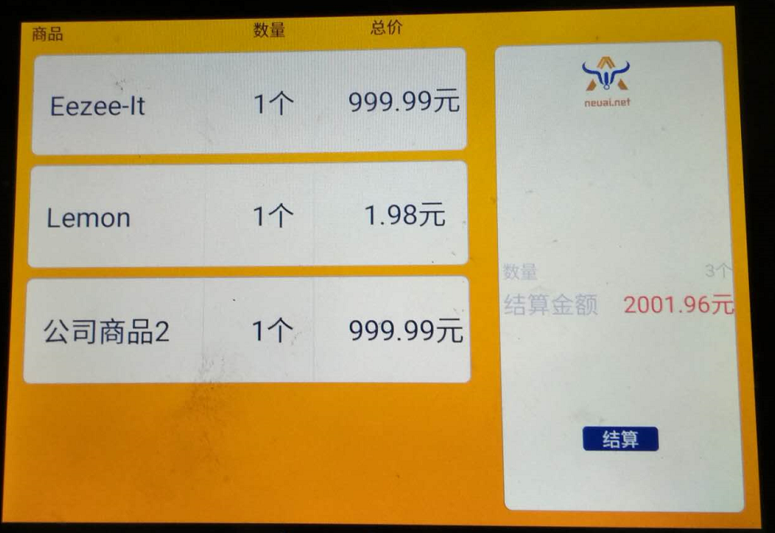
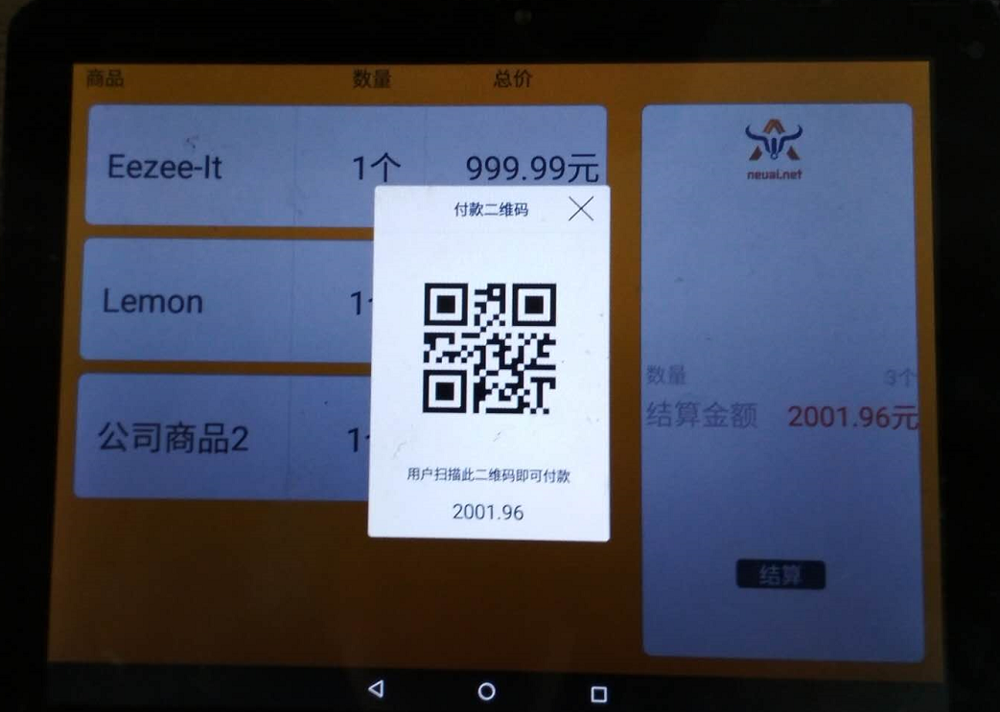

.. _android:

安卓结算APP
============================

基本功能
----------------------------

- **软件基本流程**

- **首页**

  + 进入首页连接服务器认证
  + 认证成功后等待框消失

	

	
- **商品信息页**

  + 商品放在扫描设备识别范围内
  + 通过服务器获取设备信息
  + 左侧显示商品基本信息
  + 右侧显示汇总信息
  

- **结算页**

  + 点击结算按钮
  + 弹出二维码支付页面
  + 手机支付成功后页面关闭回到首页

代码分析
----------------------------

- **BaseActivity基类**

页面基类，实现网络的调用，实现弹出等待窗体，提示窗体以及记录窗体状态。
::

	public abstract class BaseActivity extends FragmentActivity implements DialogInterface.OnCancelListener,
																			   PopupWindow.OnDismissListener,
																			   IClient
	{

		protected abstract void handleSuccessResponse(String action, String body) throws InterruptedException;
		protected abstract void handleErrorResponse(String msg);
		protected abstract int getRootLayoutId();

		// 具备动画效果的等待会话框
		private Dialog mWaitingDialog = null;
		private RotateAnimation mWaitingDialogAnimation = null;

		// 显示在页面下方的提示对话框
		private PopupWindow popupHitWindow;
		// 对话框自动消失的处理句柄
		private AutoDismissHandler autoDismissHandler = null;

		// 当前Activity的活动标记
		private boolean isActive;

		public boolean isLogin() {
			return isLogin;
		}

		private  boolean isLogin;

		Handler mudpReceive = new Handler() {
			@Override
			public void handleMessage(Message msg) {

				if(msg.what == 0x222){
					String server = (String)msg.obj;
					NEUAIMerchantApplication.instance().setmServer(server);
					SetSocketClient();
				}else{
					CreateConnect();
				}

			}
		};

		private static class AutoDismissHandler extends Handler {
			private WeakReference<BaseActivity> activityRef = null;

			public AutoDismissHandler(BaseActivity activity) {
				activityRef = new WeakReference<BaseActivity>(activity);
			}

			public void handleMessage(Message msg) {
				if (activityRef != null && activityRef.get() != null) {
					if (msg.what == 0) {
						activityRef.get().popupHintAboutToDismiss();
					}
				}
			}
		}

		@Override
		protected void onCreate(@Nullable Bundle savedInstanceState) {
			super.onCreate(savedInstanceState);
			NEUAIMerchantApplication.instance().addRunningActivity(this);
			isActive = true;
			initWaitingDialog();
		}

		@Override
		protected void onStart() {
			super.onStart();
		}

		@Override
		protected void onResume() {
			super.onResume();
			isActive = true;
		}

		public void CreateConnect(){
		   if(NEUAIMerchantApplication.instance().getmServer().isEmpty()){
			   new udpSendReceive(mudpReceive).start();
		   }else{
			   SetSocketClient();
		   }
		}

		public void SetSocketClient(){
			SocketObject.getInstance().setClient(this);
		}

		public void makeJSONRequest(String headerLen,String headerData,String body){
			SocketObject.getInstance().SendData(headerLen,headerData,body);
		}

		public void makeJSONRequest(String action,CommonRequest request){
			RestClient.getInstance().sendRequest(action,request,this);
		}
		/**
		 * 获取当前Activity的活动状态
		 * @return
		 */
		public boolean isActive() {
			return isActive;
		}

		@Override
		public void OnConnectSuccess(){
			if( !isLogin ){
				LoginRequest();
			}
		}

		@Override
		public void OnError(String content){
			isLogin = false;
			handleErrorResponse(content);

			new udpSendReceive(mudpReceive).start();
		   // CreateConnect();
		}

		@Override
		protected void onDestroy() {
			super.onDestroy();
			isActive = true;

			if (mWaitingDialog != null) {
				mWaitingDialog.dismiss();
				mWaitingDialog = null;
			}
			isActive = false;
			NEUAIMerchantApplication.instance().removeRunningActivity(this);
		}

		@Override
		protected void onPause() {
			super.onPause();
			isActive = false;
		}

		/**
		 * 初始化等待对话框，多用于网络请求
		 */
		@SuppressLint("InflateParams")
		private void initWaitingDialog() {

			mWaitingDialog= new Dialog(this, R.style.dialog_waiting_bg);
			mWaitingDialog.setContentView(getLayoutInflater().inflate(R.layout.dialog_waiting_loading, null));
			Window dialogWindow = mWaitingDialog.getWindow();
			dialogWindow.setGravity(Gravity.CENTER);

			mWaitingDialogAnimation = new RotateAnimation(0, 360 * 100,
					Animation.RELATIVE_TO_SELF, .5f, Animation.RELATIVE_TO_SELF, .5f);
			mWaitingDialogAnimation.setInterpolator(new LinearInterpolator());
			mWaitingDialogAnimation.setRepeatCount(100);
			mWaitingDialogAnimation.setDuration(2000 * 100);
			mWaitingDialog.setCancelable(false);
			mWaitingDialog.setOnCancelListener(this);
		}

		/**
		 * 显示等待对话框
		 * @param text
		 */
		@SuppressLint("InflateParams")
		public void showWaitingDialog(String text) {
			if (!isActive) {
				return;
			}
			dismissWaitingDialog();
			ImageView imageView = (ImageView) mWaitingDialog.findViewById(R.id.ind_image);
			imageView.startAnimation(mWaitingDialogAnimation);
			((TextView) mWaitingDialog.findViewById(R.id.ind_text)).setText(text);
			mWaitingDialog.show();
		}

		/**
		 * 隐藏等待会话框
		 */
		public void dismissWaitingDialog() {
			if (mWaitingDialog != null && mWaitingDialog.isShowing()) {
				if(mWaitingDialogAnimation != null) {
					mWaitingDialogAnimation.cancel();
				}
				mWaitingDialog.dismiss();
			}
		}

		@Override
		public void onCancel(DialogInterface dialog) {
			dialog.dismiss();
		}

		void LoginRequest(){
			Gson gson = new Gson();
			LoginRequest login = new LoginRequest();
			login.id = Util.DEVICEID;
			login.length = "0";
			login.action = "login";
			String loginData = gson.toJson(login);//"{\"id\":\"dianzibiaoqian_01\", \"length\":2000, \"action\":\"login\"}";

			HeaderRequest header = new HeaderRequest();
			header.action = "login";
			header.length = Integer.toString(loginData.length());
			header.equipId = "android1";
			String headerData = gson.toJson(header);
			String length = Util.intToHex(headerData.length());

			SocketObject.getInstance().SendData(length,headerData,loginData);
		}

		@Override
		public void OnSuccess(String action,String content) throws InterruptedException {
			if(action.equals("loginReturn")){//登录
				isLogin = true;
			}

			handleSuccessResponse(action,content);

		}

		/**
		 * 显示弹出式提示对话框，显示在屏幕下方
		 * @param text
		 */
		@SuppressLint("InflateParams")
		public void showPopupHint(String text) {
			if (!isActive) {
				return;
			}
			View layout = null;

			if (popupHitWindow == null) {
				layout = getLayoutInflater().inflate(R.layout.view_popup_hint, null);
				popupHitWindow = new PopupWindow(layout, ViewGroup.LayoutParams.MATCH_PARENT,
						ViewGroup.LayoutParams.WRAP_CONTENT);
				popupHitWindow.setContentView(layout);
				popupHitWindow.setOnDismissListener(this);
			} else if (popupHitWindow.isShowing()) {
				popupHitWindow.dismiss();
			}
			layout = popupHitWindow.getContentView();
			TextView indication = (TextView) layout.findViewById(R.id.indication);
			indication.setText(text);
			popupHitWindow.update();
			AlphaAnimation animation = new AlphaAnimation(0, 1);
			animation.setDuration(300);
			indication.startAnimation(animation);
			View parent = getRootLayout();
			if (parent != null) {
				popupHitWindow.showAtLocation(parent, Gravity.BOTTOM | Gravity.LEFT, 0, 0);
			}
			if (autoDismissHandler == null) {
				autoDismissHandler = new AutoDismissHandler(this);
			}
			autoDismissHandler.sendEmptyMessageDelayed(0, 2500);
		}

		private void popupHintAboutToDismiss() {
			if (popupHitWindow == null) {
				return;
			}
			View layout = popupHitWindow.getContentView();
			View indication = layout.findViewById(R.id.indication);
			AlphaAnimation animation = new AlphaAnimation(1, 0);
			animation.setDuration(300);
			indication.startAnimation(animation);
			animation.setAnimationListener(new Animation.AnimationListener() {

				@Override
				public void onAnimationStart(Animation animation) {

				}

				@Override
				public void onAnimationRepeat(Animation animation) {

				}

				@Override
				public void onAnimationEnd(Animation animation) {
					popupHitWindow.dismiss();
				}
			});
		}

		/**
		 * 获取页面的根节点视图
		 * @return
		 */
		private View getRootLayout() {
			return findViewById(getRootLayoutId());
		}

		@Override
		public void onDismiss() {
			if (autoDismissHandler != null) {
				autoDismissHandler.removeMessages(0);
			}
		}
	}
	
- **StartActivity类**

启动页面类，负责连接服务器和认证登录。
::

	public class StartActivity extends BaseActivity {

		PrinterController pc = new PrinterController();

		@Override
		public void onCreate(Bundle savedInstanceState) {
			super.onCreate(savedInstanceState);
			setContentView(R.layout.activity_start);

		   // requestPermissions();
			Button scanbtn = (Button)findViewById(R.id.Scanbtn);
			scanbtn.setOnClickListener(new View.OnClickListener() {
				@Override
				public void onClick(View v) {
				 startActivity( new Intent(StartActivity.this, MainActivity.class));
				}
			});

		   CreateConnect();
			showWaitingDialog("正在连接服务器，请等待...");
		}

		@Override
		void LoginRequest(){
			super.LoginRequest();
		}

		@Override
		public void handleSuccessResponse(String action, String content) {
			dismissWaitingDialog();
		}

		@Override
		protected void handleErrorResponse(String msg){
			dismissWaitingDialog();
			Toast.makeText(this,msg, Toast.LENGTH_SHORT);
		}
		@Override
		public void onBackPressed() {
			NEUAIMerchantApplication.instance().exit();
		}
		@Override
		protected int getRootLayoutId() {
			return R.id.loginview;
		}

- **MainActivity类**

主体业务处理页面，触发扫描商品，结算，显示商品信息，显示结算信息等。

scanSuc接口扫描成功后组织数据发送给服务器获取数据
::

   /**
     * 扫描成功触发获取商品
     *
     * @return
     */
    @Override
    public void scanSuc(List<String> content) {

       // Log.e("GoodsList",m_Gson.toJson(content));
        if(mStatus == 1){
            return;
        }

        //在商品表中查找是否有新商品
        String codes = "";
        for(int i = 0;i < content.size();i++){
            boolean isFind = false;
            for(int j = 0;j <mRealIds.size();j++){
               // Goods goods = mGoods.get(j);
                if( mRealIds.get(j).equals(content.get(i))){
                    isFind = true;
                    break;
                }
            }
            if(!isFind){
                mIds.add(content.get(i));
            }
        }

        if(mIds.size() == 0){
            return;
        }

        GoodRequest gr = new GoodRequest();
        String body = mIds.toString().replace('[',' ').replace(']',' ').trim();
        gr.setCode(body);
        String bodyJson = m_Gson.toJson(gr);

        HeaderRequest header = new HeaderRequest();
        header.length = Integer.toString(Util.getLength(bodyJson));
        header.action = "getGoods";
        header.uniqueId="android1";
        String headerjson = m_Gson.toJson(header);

        String length = Util.intToHex(headerjson.length());

        makeJSONRequest(length,headerjson,bodyJson);
        mStatus = 1;
        showWaitingDialog("正在获取商品信息，请等待...");
    }

SettlementClickListener接口触发结算。
::

	/**
     * 点击结算按钮
     *
     * @return
     */
    public class SettlementClickListener implements View.OnClickListener{

        @Override
        public void onClick(View v) {

            if(mGoods.size()==0){
                showPopupHint("无商品可以结算，请选择需要购买的商品。");
                return;
            }

            showWaitingDialog("正在处理数据，请等待...");

            SimpleDateFormat simpleDateFormat = new SimpleDateFormat("yyyyMMddHHmmss");
            //获取当前时间
            Date date = new Date(System.currentTimeMillis());

            Random random = new Random();
            String orderID = simpleDateFormat.format(date) + "";

            GoodResponse gr = new GoodResponse();
            gr.order_id = orderID;
            gr.goods = mGoods;
            String body = m_Gson.toJson(gr);

            HeaderRequest header = new HeaderRequest();
            header.length = Integer.toString(Util.getLength(body));
            header.action = "getPayInfo";
            header.uniqueId="android1";
            String headerjson = m_Gson.toJson(header);
            Logger.log("Settlemnet:" + body +"; header:" + headerjson);
            Log.e("Settlemnet",header.length);
            String length = Util.intToHex(headerjson.length());

            makeJSONRequest(length,headerjson,body);

        }
    }
	
handleSuccessResponse处理所有服务器返回数据
::

   /**
     * 网络数据成功返回
     *
     * @return
     */
    @Override
    public void handleSuccessResponse(String action,String content) throws InterruptedException {
        Log.e("HandleAction",content);

        if(action.equals("loginReturn")){//登录

            // scanSuc("111");
        }else if( action.equals("getGoodsReturn")){//获取商品信息
            dismissWaitingDialog();
            GoodResponse gr = new GoodResponse();
            gr = m_Gson.fromJson(content,GoodResponse.class);

            for( int i = 0;i< gr.goods.size();i++){
                Goods goods_t = gr.goods.get(i);
                //遍历mGoods看看有没有当前这个商品
                boolean b_find = false;
                for(int j = 0;j <mGoods.size();j++){
                    Goods goodsItem = mGoods.get(j);
                    if(goods_t.name.equals( goodsItem.name )){
                        int count = Integer.parseInt(goodsItem.count);
                        count++;
                        goodsItem.count = Integer.toString(count);
                        b_find = true;
                       break;
                    }
                }

                if(!b_find){
                    goods_t.count = "1";
                   mGoods.add(goods_t);
                }

            }
            //更新页面
            if(mGoods.size() > 0){
                mAdapter.updateDataSet(mGoods);

                float amount = 0;//更新缴费金额
                int count = 0;//当前商品数量
                for (int i = 0;i < mGoods.size();i++){
                    Goods goods = mGoods.get(i);
                    amount = Float.parseFloat(goods.standardPrice) * Integer.parseInt(goods.count) + amount;
                    count = count + Integer.parseInt(goods.count);
                }
                BigDecimal decimal = new BigDecimal(Float.toString(amount));
                mAmount = decimal.setScale(2, BigDecimal.ROUND_HALF_UP).floatValue();
                mCount = count;
                mPaymentAmount_Main.setText(Float.toString(mAmount));
                mPaymentCount_Main.setText(Integer.toString(mCount));
                mRealIds.addAll(mIds);
                mIds.clear();//处理完成数据后清空，状态设置成处理完成
                mStatus = 0;
            }

        }else if( action.equals("getPayInfoReturn")){//支付码
            dismissWaitingDialog();
            PayResponse pr = new PayResponse();
            pr = m_Gson.fromJson(content,PayResponse.class);
            //得到二维码信息并显示
            String qrstr = pr.url;
            try {
                showPayCodeView(qrstr);
            } catch (WriterException e) {
                e.printStackTrace();
            }

        }else if(action.equals("sendPayResult")){//打印
            //
            dismissPayCodeView();
            PrintResponse pr = new PrintResponse();
            pr = m_Gson.fromJson(content,PrintResponse.class);

            String printList = m_Gson.toJson(pr.printList);//需要传给打印的打印的内容。
            Log.e("printlist",printList);

            if(printList.length() > 0){
                if(mPrinterPresenter == null){
                    mPrinterPresenter = new PrinterPresenter(this);
                }
                mPrinterPresenter.print(printList);
            }

            Thread.sleep(1000);

            finish();

        }else{//心跳

        }
    }

二维码支付页面的初始化，显示和关闭。
::

	/**
     * 初始化二维码页面
     *
     * @return
     */
    private void initPayCodeView() {
        LayoutInflater inflater = (LayoutInflater) getSystemService(Context.LAYOUT_INFLATER_SERVICE);
        mPopupPayCode = inflater.inflate(R.layout.pay_code_view, null);
        mPopupPayCode.findViewById(R.id.cashier_desk_pay_close_img).setOnClickListener(new View.OnClickListener() {
            @Override
            public void onClick(View v) {
                dismissPayCodeView();
            }
        });
        mPaymentQrCode = (ImageView) mPopupPayCode.findViewById(R.id.cashier_desk_pay_code_img);
        mPaymentAmount_QR = (TextView) mPopupPayCode.findViewById(R.id.cashier_desk_pay_code_amount);

        mPopUpWindow = new PopupWindow(mPopupPayCode, ActionBar.LayoutParams.MATCH_PARENT,
                ActionBar.LayoutParams.MATCH_PARENT);
        mPopUpWindow.setOutsideTouchable(false);
        mPopUpWindow.setTouchable(true);
        mPopUpWindow.setFocusable(true);
    }

    /**
     * 显示二维码页面
     *
     * @return
     */
    private void showPayCodeView(String url) throws WriterException {
        dismissPayCodeView();

        mPaymentAmount_QR.setText(Float.toString(mAmount));
        mPaymentQrCode.setImageBitmap(Util.create2DCode(url,200));
        mPopUpWindow.showAtLocation(findViewById(R.id.main_view),
                Gravity.CENTER, 0, 0);
        mPopUpWindow.update();
    }

    /**
     * 关闭二维码页面
     *
     * @return
     */
    private void dismissPayCodeView() {
        if(mPopUpWindow != null) {
            mPopUpWindow.dismiss();
        }
    }

- **SocketObject**

处理网络连接和数据的发送与接收

::

    /**
     * socket处理核心方法在此接口中处理，socket初始化，数据回调等
     *
     * @return
     */
    private SocketClient localSocketClient;
    public SocketClient getLocalSocketClient() {
        if (this.localSocketClient == null) {
            this.localSocketClient = new SocketClient(new SocketClientAddress(NEUAIMerchantApplication.instance().getmServer(), 8686));
            this.localSocketClient.getAddress().setConnectionTimeout(15 * 1000);

            this.localSocketClient.registerSocketClientDelegate(new SocketClientDelegate() {
                @Override
                public void onConnected(SocketClient client) {
                    Logger.log("Local onConnected");
                    isDisconnect = false;
                    m_client.OnConnectSuccess();
                }

                @Override
                public void onDisconnected(SocketClient client) {
                    Logger.log("Local onDisconnected");
                    isDisconnect = true;
                    m_client.OnError("服务器错误，请重试。");
                }

                @Override
                public void onResponse(SocketClient client, @NonNull SocketResponsePacket responsePacket) {
                    Logger.log(responsePacket.getMessage());
                }
            });
            this.localSocketClient.registerSocketClientSendingDelegate(new SocketClientSendingDelegate() {

                @Override
                public void onSendPacketBegin(SocketClient client, SocketPacket packet) {
                    Logger.log("Local onSendPacketBegin " + packet.getID());
                }

                @Override
                public void onSendPacketCancel(SocketClient client, SocketPacket packet) {
                    Logger.log("Local onSendPacketCancel " + packet.getID());
                }

                @Override
                public void onSendPacketEnd(SocketClient client, SocketPacket packet) {
                    Logger.log("Local onSendPacketEnd " + packet.getID());
                }

                @Override
                public void onSendPacketProgress(SocketClient client, SocketPacket packet, float progress) {
                    Logger.log("Local onSendPacketProgress " + packet.getID() + "  progress : " + progress);
                }
            });
            this.localSocketClient.registerSocketClientReceiveDelegate(new SocketClientReceiveDelegate() {
                @Override
                public void onResponse(SocketClient client, @NonNull SocketResponsePacket responsePacket) throws InterruptedException {
                    Logger.log("Local onResponse 【" + responsePacket.getMessage() + "】");

                    String content = responsePacket.getMessage();

                    switch (mStatus){
                        case IDLING:{
                            int headerLen =  Util.hexToDecimal(content.substring(0,4));

                            String headerData = content.substring(4,headerLen+4);
                            HandleHeaderReturn(headerData);
                            if(mStatus == STATUS.IDLING){
                                return;
                            }
                            String body = content.substring(4+headerLen);

                            if( body.length() == m_Length){
                                m_client.OnSuccess(m_Action, body);
                                mStatus = STATUS.IDLING;
                            }else{
                                m_content += body;
                            }

                            break;
                        }
                        case LOADING:{//获取header return 信息判断是什么业务数据
                            int len = content.length();
                            if(len == m_Length){

                                HandleHeaderReturn(m_content);
                            }

                            break;
                        }
                        default:{//获取业务数据
                            int len = content.length();
                            int curLen = m_content.length();
                            if(len + curLen == m_Length){
                                m_content = m_content + content;
                                m_client.OnSuccess(m_Action,content);
                                mStatus = STATUS.IDLING;
                            }else{
                                m_content = m_content + content;
                            }

                            break;
                        }
                    }
                }

                @Override
                public void onHeartBeat(SocketClient socketClient) {
                    Logger.log("Local onHeartBeat ");
                }
            });
        }
        return this.localSocketClient;
    }

    /**
     * 发送socket请求
     *
     * @return
     */
   public void SendData(String headerLen,String headerData,String body){
        getLocalSocketClient().sendString(headerLen);
        getLocalSocketClient().sendString(headerData);
        getLocalSocketClient().sendString(body);
    }

    /**
     * 解析header数据
     *
     * @return
     */
    void HandleHeaderReturn(String content) throws InterruptedException {
        HeaderResponse header = new HeaderResponse();
        header = m_Gson.fromJson(content,HeaderResponse.class);
        int datalen = Integer.parseInt(header.length);
        if(datalen !=0){
            m_Action = header.action;
            m_Length = datalen;
            mStatus = STATUS.PROCESSING;
        }else{
            mStatus = STATUS.IDLING;
            m_Action = header.action;
            if(m_Action.equals("loginReturn")){
                m_client.OnSuccess("loginReturn",content);
            }else if(m_Action.equals("health")){
                HeaderRequest headerR = new HeaderRequest();
                headerR.action = "healthReturn";
                headerR.length = "14";
                headerR.uniqueId = "android1";
                Gson gson = new Gson();
                String headerData = gson.toJson(headerR);
                String length = Util.intToHex(headerData.length());
                SendData(length,headerData,"{exception:\"\"}");
            }
        }
    }
	

- **udpSendReceive类**

udp数据发送获取连接的服务器地址

::

	public class udpSendReceive extends  Thread {

		Socket socket = null;
		MulticastSocket ms = null;
		DatagramPacket dp;
		Handler handler = new Handler();
		DatagramSocket dgSocket =null;

		public udpSendReceive(Handler handler) {
			this.handler = handler;
		}
		@Override
		public void run() {
			try {
				Thread.sleep(5000);
			} catch (InterruptedException e) {
				e.printStackTrace();
				handler.sendEmptyMessage(0x01);
				return;
			}
			Message msg;
			String information;

			byte[] data = new byte[1024];

			String gateway = Util.getGateway();
			if(gateway.isEmpty()){
				gateway = "192.168.5.255";
			}

			String[] arr = gateway.split("\\.");
			gateway = arr[0] + "." + arr[1] + ".";

			try {
				InetAddress groupAddress = InetAddress.getByName(gateway + "5.255");
				dp =  new DatagramPacket(data, data.length, groupAddress, 8061);

				int port = 8061;
				if(dgSocket==null){
					dgSocket = new DatagramSocket();
				}
				dgSocket.send(dp);
			} catch (Exception e) {
				e.printStackTrace();
				handler.sendEmptyMessage(0x01);
				return;
			}

			while (true) {
				try {

				   if (dgSocket != null)
					   dgSocket.receive(dp);
				} catch (Exception e) {
					e.printStackTrace();
					handler.sendEmptyMessage(0x01);
					return;
				}

				if (dp.getAddress() != null) {
					final String quest_ip = dp.getAddress().toString();

					String host_ip = getLocalHostIp();

					System.out.println("host_ip:  --------------------  " + host_ip);
					System.out.println("quest_ip: --------------------  " + quest_ip.substring(1));

					/* 若udp包的ip地址 是 本机的ip地址的话，丢掉这个包(不处理)*/

					if( (!host_ip.equals(""))  && host_ip.equals(quest_ip.substring(1)) ) {
						continue;
					}

					msg = new Message();
					msg.what = 0x222;
					information = quest_ip.substring(1);
					msg.obj = information;
					handler.sendMessage(msg);
					break;
				}
			}
		}

		private String getLocalHostIp() {
			String ipaddress = "";
			try {
				Enumeration<NetworkInterface> en = NetworkInterface
						.getNetworkInterfaces();
				// 遍历所用的网络接口
				while (en.hasMoreElements()) {
					NetworkInterface nif = en.nextElement();// 得到每一个网络接口绑定的所有ip
					Enumeration<InetAddress> inet = nif.getInetAddresses();
					// 遍历每一个接口绑定的所有ip
					while (inet.hasMoreElements()) {
						InetAddress ip = inet.nextElement();
						if (!ip.isLoopbackAddress()
								) {
							return ip.getHostAddress();
						}
					}
				}
			}
			catch(SocketException e)
			{
				Log.e("feige", "获取本地ip地址失败");
				e.printStackTrace();
			}
			return ipaddress;
		}
	}

- **NEUAIMerchantApplication类**

Application类负责管理页面，以及应用的退出。

::

	public class NEUAIMerchantApplication extends Application {
		private static NEUAIMerchantApplication mTheApp = null;

		private  String mServer = "";
		private ArrayList<Activity> runningActivities = new ArrayList<Activity>();

		public static NEUAIMerchantApplication instance() {
			return mTheApp;
		}

		@Override
		public void onCreate() {
			super.onCreate();
			mTheApp = this;
			RestClient.getInstance().init(this);
		}

		public void addRunningActivity(Activity a) {
			runningActivities.add(a);
		}

		public void removeRunningActivity(Activity a) {
			runningActivities.remove(a);
		}

		/**
		 * 退出应用
		 */
		public void exit() {
			for (Activity act : runningActivities) {
				act.finish();
			}
			System.exit(0);
		}

		public  String getmServer() {
			return mServer;
		}

		public  void setmServer(String server) {
			mServer = server;
		}

	}