.. _quickref-index:

服务器环境搭建
------------------------------------

- **win10下odoo10开发环境搭建**

- **所需依赖**

  + Python2.7
  + odoo10.0
  + Node.js
  + PostgreSQL 9.5
  + eclipse 最新版加python的pdv插件 
  + ERP代码：
  + https://gitlab.com/jiangkan/newretail/tree/master/erp

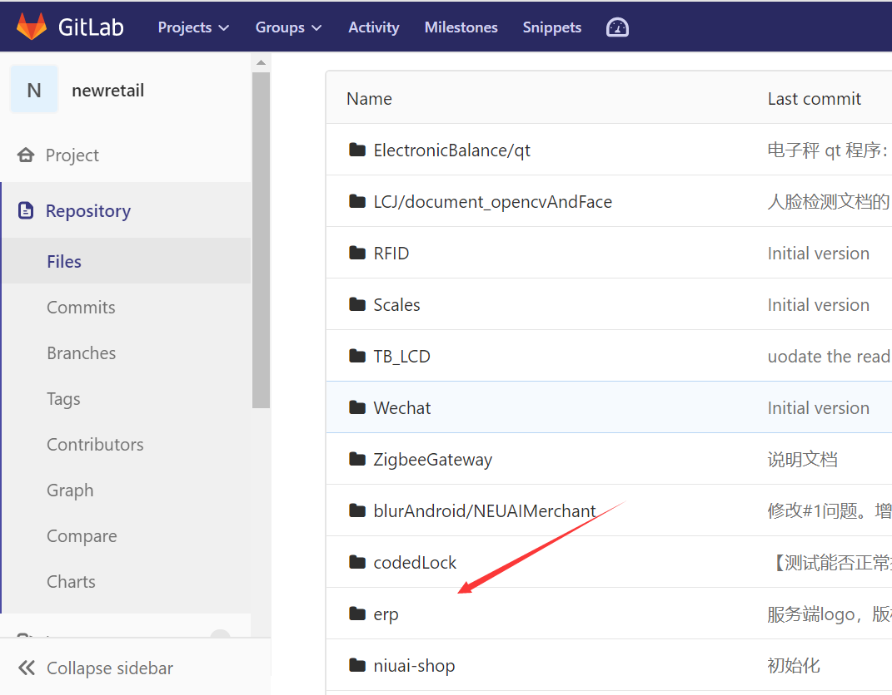

- **Python 2.7**

  + https://www.python.org/downloads/release/python-2713/

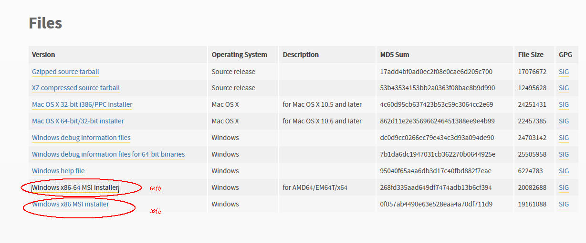

- **安装pywin32**

  + https://sourceforge.net/projects/pywin32/files/pywin32/Build%20221 (windows 7 下载相应版本，windows 10 下载32位) 
  + Python2.7下载，Odoo目前还是只支持Python2.7

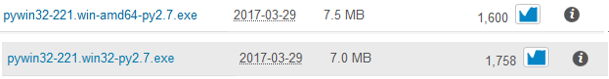

- **安装PostgreSql**

  + https://www.enterprisedb.com/downloads/postgres-postgresql-downloads#windows
  + 下载完成安装完后新建一个odoo_user的用户即可，默认系统用户postgres是不能运行odoo的

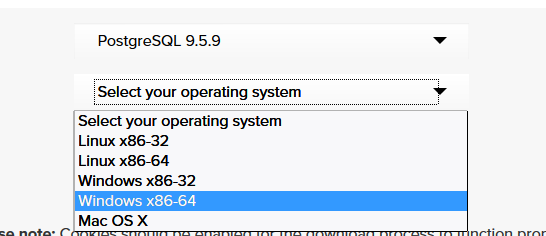
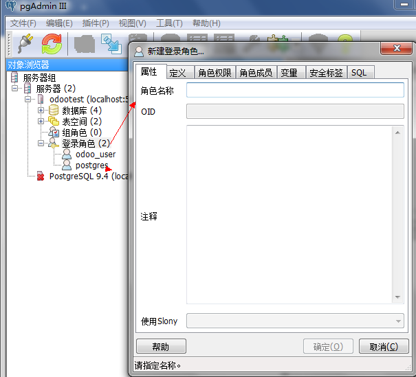

- **安装node.js**

  + https://nodejs.org/en/download/
  + odoo还需要Less 是一门 CSS 预处理语言（安装完node.js才可

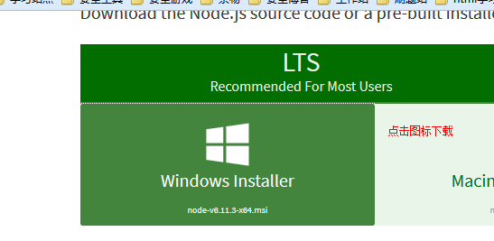

- **安装less**

  + npm install -g less

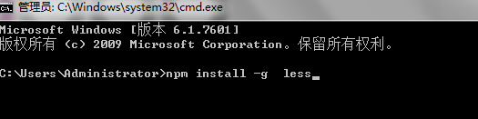

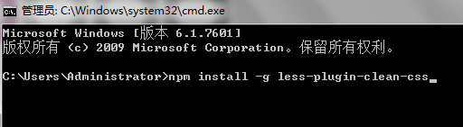

- **配置修改odoo.conf文件**
 
  +在源码目录下有一个requirementss.txt文件，里面标明了所依赖的第三方lib
  +将下载好的odoo源码解压至D盘（可以解压至你想要的盘）用IDE打开找到odoo.conf配置数据库连接

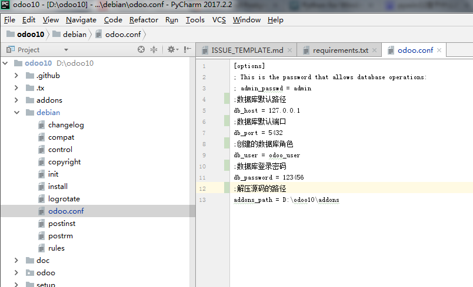

  + 第三方lib安装IDE会在联网的情况下自动识别安装，有错误的回到requirements.txt用#注释即可
  + IDE配置odoo服务起启动环境

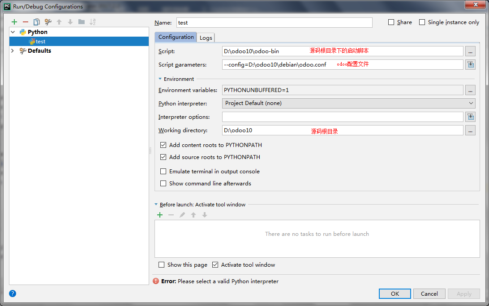

- **运行**
  + 就可以访问 localhost:8069

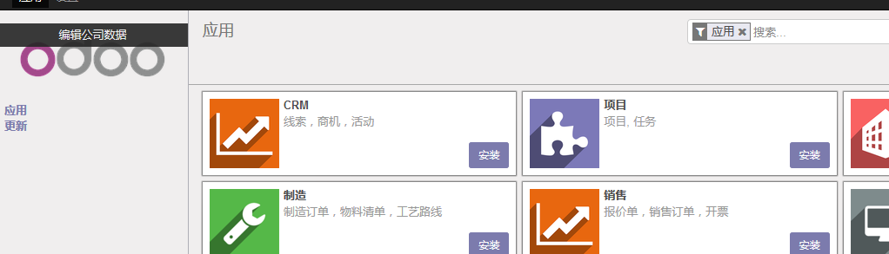

.. toctree::
   :maxdepth: 2
   :numbered:

