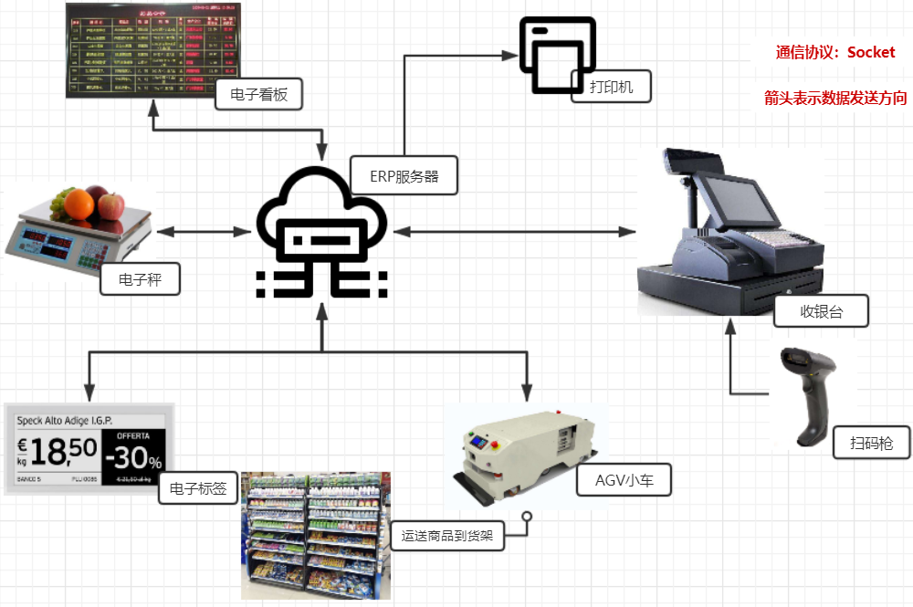
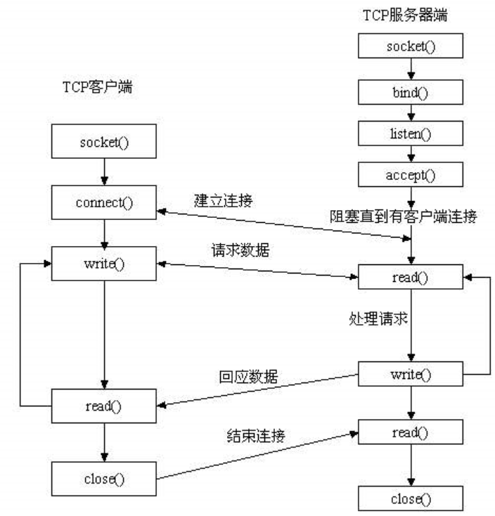

.. _quickref-index:

服务端通信接口与数据格式
============================

通信概述
------------------------------------

    新零售无人商店目前在实际应用中的典型例子是阿里旗下的欧尚超市、物美超市等。改变超市以POS机配备收银员结算的传统方式，转变成用户在智能结算终端的自助扫码机识别商品，进而生成订单并利用二维码付款，并打印小票。超市采用自助售货方式时，一般在一个通道安装6~8台智能结算终端，再配合一名保安巡查客户是否存在漏扫的行为。可以推断该方式对传统的超市运营模式改动较小，将是未来五至十年应用最广泛的新零售业态。

- **下图描述了一个相对完整的，新零售设备通信示意图**
 
  + 1.	电子看板里显示的信息是由服务器统一设定并时时更新的。
  + 2.	货架上摆放这商品和电子价签，商品的价格是由服务器统一设定并时时更新的，方便价格调整和打折优惠信息显示。
  + 3.	货架上的商品不足时，工作人员可以通过服务端设定AGV小车进行动态补货。
  + 4.	电子秤里的商品信息和价格信息都是由服务器统一设定并时时更新，生鲜类商品称重后电子秤会显示商品单价和总价，用户扫码后即可在实现线支付。
  + 5.	用户在选择好商品后可以自主去收银台进行结账，用扫码枪进行扫码后收银台会显示商品总价和支付二维码，用户扫码支付完成后小票会自动打印从而实现一个完整购物流程。

通信原理
------------------------------------

    ERP服务器端可以时时和新零售周边设备（电子价签，电子秤，电子看板等）进行通信，考虑到周边设备进行时时通信的通信效率和周边设备本身的运行效率。本次项目采用的通信协议为Socket通信，一个服务器端连接多个新零售设备，通信数据采用Json。

- **1.1.	注意事项：**

  + 1.1.1.	通信字符编码采用UTF-8
  + 1.1.2.	本文档采用Python语言实现通信开发
  + 1.1.3.	避免TCP通信出现粘包现象

- **为了避免Socket通信中的粘包现象，发送数据证实数据前首先发送json数据的数组长度，例如：发送如下字符串时，需要以下操作**

  + a.	发送固定报头长度
  + b.	发送报头数据
  + c.	发送数据体数据

- **1.2.	通信设备与ERP服务器的通用接口**

为保证服务器的安全防止数据的泄露和篡改，在通信前需要做身份验证，设备需要给服务端传递一个设备标识，身份验证成功后ERP服务器会给设备一个身份标识，在之后的每次数据传输中，都会用到这个标识，如果标识不正确服务器会拒绝服务。如果不需要服务器服务时可以退出登录。

- **1.2.1.	获取登陆身份认证login**
1.2.1.1.	请求参数

注意equipId，需要带设备类型然后是下划线_最后是设备唯一标识

例如：
DZBQ_0001 电子标签_标识
DZC_0001 电子秤_标识

数据体参数	英文标识	类型	数据举例
设备的唯一名称，注意不能重复	equipId	string	@mock=dianzibiaoqian_01
数据体数据长度	length	number	@mock=2000
要执行的操作	action	string	@mock=login

例子：
{"id":"dianzibiaoqian_01", "length":2000, "action":"login"}

- **1.2.1.2.	响应参数**

a.数据报头

数据体参数	英文标识	类型	数据举例
要执行的操作	action	string	@mock=loginReturn
数据体数据长度	length	number	@mock=2000
服务器返回的唯一设备标识，如果登陆
失败，这个字段返回空	uniqueId	string	@mock=dzbq_mac_net

b.数据报体

数据体参数	英文标识	类型	数据举例
处理失败则返回错误消息,正常处理返回空	exception	string	@mock=

- **1.2.2.	退出登录logout**

1.2.2.1.	请求参数

a.数据报头

数据体参数	英文标识	类型	数据举例
数据体数据长度	length	number	@mock=2000
要执行的操作	action	string	@mock=logout
服务器返回的唯一设备标识	uniqueId	string	@mock=dzbq_mac_net

- **2.	通信设备与服务器的个性化接口**

- **2.1.	电子价签主要接口**

2.1.1.	服务器端向价签推送商品信息sendGoods

2.1.1.1.	请求参数

a.数据报头

数据体参数	 英文标识	类型	         数据举例    
服务器返回的唯一设备标识     uniqueId        string       @mock=dzbq_mac_net     
数据体数据长度	  length	number      	          @mock=2000          
要执行的操作	  action	string	         @mock=sendGoods             

b.数据报体

（参照2.1.3）

2.1.1.2.	响应参数
a.数据报头
数据体参数	英文标识	类型	数据举例
数据体数据长度	length	number	@mock=2000
服务器返回的唯一设备标识
	uniqueId	string	@mock=dzbq_mac_net
要执行的操作	action	string	@mock=sendGoodsReturn
b.数据报体
数据体参数	英文标识	类型	数据举例
处理失败则返回错误消息,正常处理返回空	exception	string	@mock=

2.1.2.	服务器端定时发送数据定时检查设备是否可用health
2.1.2.1.	请求参数
a.数据报头
数据体参数	英文标识	类型	数据举例
服务器返回的唯一设备标识	uniqueId	string	@mock=dzbq_mac_net
数据体数据长度	length	number	@mock=2000
要执行的操作	action	string	@mock=health

2.1.2.2.	响应参数
a.数据报头
数据体参数	英文标识	类型	数据举例
数据体数据长度	length	number	@mock=2000
服务器返回的唯一设备标识
	uniqueId	string	@mock=dzbq_mac_net
要执行的操作	action	string	@mock=healthReturn
b.数据报体
数据体参数	英文标识	类型	数据举例
处理失败则返回错误消息,正常处理返回空	exception	string	@mock=

2.1.3.	价签向服务端请求数据获取商品信息getGoods
2.1.3.1.	请求参数
a.数据报头
数据体参数	英文标识	类型	数据举例
数据体数据长度	length	number	@mock=2000
服务器返回的唯一设备标识	uniqueId	string	@mock=dzbq_mac_net
要执行的操作	action	string	@mock=getGoods
b.数据报体
数据体参数	英文标识	类型	数据举例
一个或多个商品扫码标识（RFID专用）	code	string	id,ids……
一个或多个电子标签mac标识（电子价签专用）	mac_id	string	id,ids……
一个或多个商品gid标识（有商品gis的情况用）	gid	string	id,ids……

2.1.3.2.	响应参数
a.数据报头
数据体参数	英文标识	类型	数据举例
数据体数据长度	length	number	@mock=2000
要执行的操作	action	string	@mock=getGoodsReturn
服务器返回的唯一设备标识	uniqueId	string	@mock=dzbq_mac_net
b.数据报体
数据体参数	英文标识	类型	数据举例
处理失败则返回错误消息,正常处理返回空	exception	string	@mock=
商品的详细信息	goods	object[]	
商品唯一标识	gid	number	
名称	name	string	
mac地址，电子标签用	mac	string	
商品扫描编码,传递来的code	scanCode	string	
价格	price	number	
成本	standardPrice	number	
描述	description	string	
地域	area	string	
特点	feature	string	
库存	stock	string	

2.2.	智能电子秤主要接口
2.2.1.	电子秤向服务器发送请求获取全部商品信息getAllGoods
2.2.1.1.	请求参数
a.数据报头
数据体参数	英文标识	类型	数据举例
服务器返回的唯一设备标识	uniqueId	string	@mock=dzbq_mac_net
数据体数据长度	length	number	@mock=2000
要执行的操作	action	string	@mock=getAllGoods
b.数据报体
数据体参数	英文标识	类型	数据举例
获取商品数据的起始位置	ost	string	@mock=0
获取商品数据个数	lmt	object[]	@mock=100

2.2.1.2.	响应参数
a.数据报头
数据体参数	英文标识	类型	数据举例
数据体数据长度	length	number	@mock=2000
服务器返回的唯一设备标识	uniqueId	string	@mock=dzbq_mac_net
要执行的操作	action	string	@mock= getAllGoodsReturn
b.数据报体
具体（参照2.1.3），比2.1.3多出以下数据
数据体参数	英文标识	类型	数据举例
商品分类名称	pcname	string	@mock=蔬菜

2.2.2.	商品信息变化后服务器端向电子秤推送指定商品信息sendGoods
2.2.2.1.	请求参数
a.数据报头
数据体参数	英文标识	类型	数据举例
数据体数据长度	length	number	@mock=2000
要执行的操作	action	string	@mock=sendGoods
服务器返回的唯一设备标识	uniqueId	string	@mock=dzbq_mac_net
b.数据报体
（参照2.1.3）
2.2.2.2.	响应参数
a.数据报头
数据体参数	英文标识	类型	数据举例
数据体数据长度	length	number	@mock=2000
服务器返回的唯一设备标识
	uniqueId	string	@mock=dzbq_mac_net
要执行的操作	action	string	@mock =sendGoodsReturn
b.数据报体
数据体参数	英文标识	类型	数据举例
处理失败则返回错误消息,正常处理返回空	exception	string	@mock=

2.2.3.	服务器端定时发送数据定时检查设备是否可用health
2.2.3.1.	请求参数
a.数据报头
数据体参数	英文标识	类型	数据举例
服务器返回的唯一设备标识
	uniqueId	string	@mock=dzbq_mac_net
数据体数据长度	length	number	@mock=2000
要执行的操作	action	string	@mock=health

2.2.3.2.	响应参数
a.数据报头
数据体参数	英文标识	类型	数据举例
数据体数据长度	length	number	@mock=2000
服务器返回的唯一设备标识
	uniqueId	string	@mock=dzbq_mac_net
要执行的操作	action	string	@mock=healthReturn
b.数据报体
数据体参数	英文标识	类型	数据举例
处理失败则返回错误消息,正常处理返回空	exception	string	@mock=

2.2.4.	电子秤向服务端请求数据获取指定商品信息getGoods
2.2.4.1.	请求参数
（参照2.1.3）
2.2.4.2.	响应参数
（参照2.1.3）

2.2.5.	支付前获取服务器必要资源（参照2.3.3）
2.2.6.	用户支付成功后服务端告诉电子秤支付成功sendPayResult
2.2.6.1.	请求参数
a.数据报头
数据体参数	英文标识	类型	数据举例
服务器返回的唯一设备标识	uniqueId	string	@mock=dzbq_mac_net
数据体数据长度	length	number	@mock=2000
要执行的操作	action	string	@mock=sendPayResult
b.数据报体
数据体参数	英文标识	类型	数据举例
订单编号	order_id	number	@mock=1
订单金额	totalPrice	number	@mock=1
处理失败则返回错误消息,正常处理返回空	exception	string	@mock=

2.2.6.2.	响应参数
a.数据报头
数据体参数	英文标识	类型	数据举例
数据体数据长度	length	number	@mock=2000
服务器返回的唯一设备标识
	uniqueId	string	@mock=dzbq_mac_net
要执行的操作	action	string	@mock= sendPayResultReturn
b.数据报体
数据体参数	英文标识	类型	数据举例
处理失败则返回错误消息,正常处理返回空	exception	string	@mock=

2.3.	POS收银台，RFID标签和扫描枪
2.3.1.	服务器端定时发送数据定时检查设备是否可用health
2.3.1.1.	请求参数
a.数据报头
数据体参数	英文标识	类型	数据举例
服务器返回的唯一设备标识
	uniqueId	string	@mock=dzbq_mac_net
数据体数据长度	length	number	@mock=2000
要执行的操作	action	string	@mock=health

2.3.1.2.	响应参数
a.数据报头
数据体参数	英文标识	类型	数据举例
数据体数据长度	length	number	@mock=2000
服务器返回的唯一设备标识
	uniqueId	string	@mock=dzbq_mac_net
要执行的操作	action	string	@mock= healthReturn
b.数据报体
数据体参数	英文标识	类型	数据举例
处理失败则返回错误消息,正常处理返回空	exception	string	@mock=

2.3.2.	扫码枪扫到商品后向服务端传递商品码获取指定商品价格等信息getGoods
2.3.2.1.	请求参数
（参照2.1.3）
2.3.2.2.	响应参数
（参照2.1.3）
2.3.3.	用户支付前去服务器获取必要资源getPayInfo
2.3.3.1.	请求参数
a.数据报头
数据体参数	英文标识	类型	数据举例
服务器返回的唯一设备标识	uniqueId	string	@mock=dzbq_mac_net
数据体数据长度	length	number	@mock=2000
要执行的操作	action	string	@mock=getPayInfo
b.数据报体
数据体参数	英文标识	类型	数据举例
订单号	order_id	string	
总价	totalPrice	number	
商品id列表，gid, standardPrice，weight列表逗号分隔	goods	list	@mock=1
处理失败则返回错误消息,正常处理返回空,errorPrice	exception	string	@mock=

2.3.3.2.	响应参数
.数据报头
数据体参数	英文标识	类型	数据举例
数据体数据长度	length	number	@mock=2000
服务器返回的唯一设备标识
	uniqueId	string	@mock=dzbq_mac_net
要执行的操作	action	string	@mock= getPayInfoReturn
b.数据报体
数据体参数	英文标识	类型	数据举例
支付网址	url	number	@mock=1
处理失败则返回错误消息,正常处理返回空	exception	string	@mock=

2.3.4.	用户支付成功后服务端告诉POS收银台支付成功sendPayResult
2.3.4.1.	请求参数
a.数据报头
数据体参数	英文标识	类型	数据举例
服务器返回的唯一设备标识	uniqueId	string	@mock=dzbq_mac_net
数据体数据长度	length	number	@mock=2000
要执行的操作	action	string	@mock=sendPayResult
b.数据报体
数据体参数	英文标识	类型	数据举例
订单编号	order_id	number	@mock=1
订单金额	totalPrice	number	@mock=1
结果,success,error	result	string	
打印信息，参照2.5.1	printList	string	
处理失败则返回错误消息,正常处理返回空	exception	string	@mock=

2.3.4.2.	响应参数
a.数据报头
数据体参数	英文标识	类型	数据举例
数据体数据长度	length	number	@mock=2000
服务器返回的唯一设备标识
	uniqueId	string	@mock=dzbq_mac_net
要执行的操作	action	string	@mock=sendPayResultReturn
b.数据报体
数据体参数	英文标识	类型	数据举例
处理失败则返回错误消息,正常处理返回空	exception	string	@mock=

2.4.	AGV小车
2.4.1.	服务器端定时发送数据定时检查设备是否可用health
2.4.1.1.	请求参数
a.数据报头
数据体参数	英文标识	类型	数据举例
服务器返回的唯一设备标识	uniqueId	string	@mock=dzbq_mac_net
数据体数据长度	length	number	@mock=2000
要执行的操作	action	string	@mock=health

2.4.1.2.	响应参数
a.数据报头
数据体参数	英文标识	类型	数据举例
数据体数据长度	length	number	@mock=2000
服务器返回的唯一设备标识
	uniqueId	string	@mock=dzbq_mac_net
要执行的操作	action	string	@mock=healthReturn
b.数据报体
数据体参数	英文标识	类型	数据举例
处理失败则返回错误消息,正常处理返回空	exception	string	@mock=

2.4.2.	服务器端向AGV小车推送商品信息和位置信息sendPosition
2.4.2.1.	请求参数
a.数据报头
数据体参数	英文标识	类型	数据举例
服务器返回的唯一设备标识	uniqueId	string	@mock=dzbq_mac_net
数据体数据长度	length	number	@mock=2000
要执行的操作	action	string	@mock=sendPosition

2.4.2.2.	响应参数
a.数据报头
数据体参数	英文标识	类型	数据举例
服务器返回的唯一设备标识
	uniqueId	string	@mock=dzbq_mac_net
数据体数据长度	length	number	@mock=2000
要执行的操作	action	string	@mock=sendPositionReturn
数据报体
数据体参数	英文标识	类型	数据举例
处理失败则返回错误消息,正常处理返回空	exception	string	@mock=
库存位置	stockPosition	object	@mock= 
通道	posx	string	
货架	posy	string	
高度	posz	string	
补货位置	goodsPosition	object	
通道	posx	string	
货架	posy	string	
高度	posz	string	

2.4.3.	AGV小车向服务发送请求获取指定商品的位置信息getPosition
2.4.3.1.	请求参数
a.数据报头
数据体参数	英文标识	类型	数据举例
服务器返回的唯一设备标识
	uniqueId	string	@mock=dzbq_mac_net
数据体数据长度	length	number	@mock=2000
要执行的操作	action	string	@mock=getPosition

2.4.3.2.	响应参数
a.数据报头
数据体参数	英文标识	类型	数据举例
数据体数据长度	length	number	@mock=2000
服务器返回的唯一设备标识
	uniqueId	string	@mock=dzbq_mac_net
要执行的操作	action	string	@mock=getPositionReturn
b.数据报体
数据体参数	英文标识	类型	数据举例
处理失败则返回错误消息,正常处理返回空	exception	string	@mock=
库存位置	stockPosition	object	@mock= 
通道	posx	string	
货架	posy	string	
高度	posz	string	
补货位置	goodsPosition	object	
通道	posx	string	
货架	posy	string	
高度	posz	string	

2.5.	打印机
2.5.1.	用户付款成功后服务器向打印机发送打印请求，打印小票
2.5.1.1.	请求参数
打印机支持串口接收数据，数据格式如下：
{"totalAmount":"5.24","productList":[{"name":"红富士苹果", "count":"1.2", "price":"1.2", "total":"2.24"},{ "name":"烤肠", "count":"1", "price":"3", "total":"3"}]}

2.6.	小程序开门MQTT
2.6.1.	扫码开门
/newretail/door/shop0001
{"id":" shop0001","action":"open"}

2.6.2.	扫码关门
/newretail/door/shop0001
{"id":" shop0001","action":"close"}

2.6.3.	支付成功
/newretail/pay/shop0001
{"id":" shop0001","action":"pay","result":"ok","order_id":"120292012883939"}

.. toctree::
   :maxdepth: 2
   :numbered:

