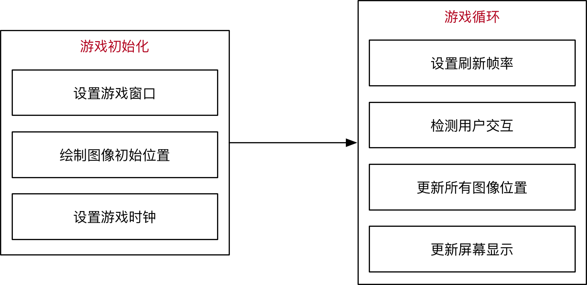

.. _snake:

贪吃蛇游戏制作
============================

基本原理
----------------------------

- **可交互的动画片**

  跟电影的原理类似，游戏中的动画效果，本质上是快速的在屏幕上绘制图像，一般在电脑上 每秒绘制 60 次，就能够达到非常连续高品质的动画效果。

- **程序基本流程**

- **游戏循环的作用**

  + 保证游戏不会直接退出
  + 变化图像位置 — 动画效果
  + 每隔一段时间移动或更新一下所有图像的位置
  + 检测用户交互 — 按键、鼠标等

- **游戏中的坐标系描述**

  + 原点在左上角 (0, 0)
  + x 轴水平方向向右，逐渐增加
  + y 轴垂直方向向下，逐渐增加
  + 在游戏中，所有可见的元素都是以矩形区域来描述位置的
  + 要描述一个矩形区域有四个要素：(x, y) (width, height)

.. image:: img/snake2.png
    :alt: snake
    :width: 340px

- **贪吃蛇的网格坐标**

  + 将屏幕分成若干10*10的网格
  + 对指定网格填充颜色形成蛇的身体
  + 对指定网格填充颜色形成食物
  + 网格左上角坐标和屏幕坐标的变换

    * x = 网格横坐标 * 10 + a
    * y = 网格纵坐标 * 10 + b

.. image:: img/snake3.png
    :alt: snake
    :width: 340px

- **贪吃蛇的移动**

  + 移动方向填充身体颜色
  + 蛇尾部填充背景颜色
  + 不能向自己的反方向前进

.. image:: img/snake4.png
    :alt: snake
    :width: 340px

代码分析
----------------------------

- **Grid网格类**
::

    class Grid(object):
        def __init__(self, master=None, x=10, y=10, w=222, h=303):
            self.x = x
            self.y = y
            self.w = w
            self.h = h
            self.width = w // 10 - 1
            self.height = h // 10 - 1
            self.bg = 0x000000
            print(self.width, self.height)

            # 画背景
            for i in range(320):
                screen.drawline(0, i, 239, i, 1, self.bg)

            # 画边界
            screen.drawline(x, y, x + w - 1, y, 1, 0xFFFFFF)
            screen.drawline(x + w - 1, y, x + w - 1, y + h, 1, 0xFFFFFF)
            screen.drawline(x, y + h, x + w - 1, y + h, 1, 0xFFFFFF)
            screen.drawline(x, y, x, y + h, 1, 0xFFFFFF)

        def draw(self, pos, color):
            x = pos[0] * 10 + self.x + 1
            y = pos[1] * 10 + self.y + 1
            for i in range(10):
                screen.drawline(x, y + i, x + 10 - 1, y + i, 1, color)

- **食物类**
::

    class Food(object):
        def __init__(self, grid, color=0xFF0000):
            self.grid = grid
            self.color = color
            self.set_pos()
            self.type = 1

        def set_pos(self):
            x = randint(0, self.grid.width - 1)
            y = randint(0, self.grid.height - 1)
            self.pos = (x, y)

        def display(self):
            self.grid.draw(self.pos, self.color)

- **蛇类**
::

    class Snake(object):
        def __init__(self, grid, color=0xFFFFFF):
            self.grid = grid
            self.color = color
            self.body = [(5, 5), (5, 6), (5, 7)]
            self.direction = "Up"
            for i in self.body:
                self.grid.draw(i, self.color)

        # 这个方法用于游戏重新开始时初始化贪吃蛇的位置
        def initial(self):
            while not len(self.body) == 0:
                pop = self.body.pop()
                self.grid.draw(pop, self.grid.bg)
            self.body = [(8, 11), (8, 12), (8, 13)]
            self.direction = "Up"
            self.color = 0xFFFFFF
            for i in self.body:
                self.grid.draw(i, self.color)

        # 蛇像一个指定点移动
        def move(self, new):
            self.body.insert(0, new)
            pop = self.body.pop()
            self.grid.draw(pop, self.grid.bg)
            self.grid.draw(new, self.color)

        # 蛇像一个指定点移动，并增加长度
        def add(self, new):
            self.body.insert(0, new)
            self.grid.draw(new, self.color)

        # 蛇吃到了特殊食物1，剪短自身的长度
        def cut_down(self, new):
            self.body.insert(0, new)
            self.grid.draw(new, self.color)
            for i in range(0, 3):
                pop = self.body.pop()
                self.grid.draw(pop, self.grid.bg)

        # 蛇吃到了特殊食物2，回到最初长度
        def init(self, new):
            self.body.insert(0, new)
            self.grid.draw(new, self.color)
            while len(self.body) > 3:
                pop = self.body.pop()
                self.grid.draw(pop, self.grid.bg)

        # 蛇吃到了特殊食物3，改变了自身的颜色,纯属好玩
        def change(self, new, color):
            self.color = color
            self.body.insert(0, new)
            for item in self.body:
                self.grid.draw(item, self.color)

- **游戏类**
::

    class SnakeGame():
        def __init__(self):
            screen.clear();
            self.grid = Grid()
            self.snake = Snake(self.grid)
            self.food = Food(self.grid)
            self.gameover = False
            self.score = 0
            self.status = ['run', 'stop']
            self.speed = 300
            self.display_food()

        # type1:普通食物  type2:减少2  type3:大乐透，回到最初状态  type4:吃了会变色
        def display_food(self):
            self.food.color = 0xFF0000
            self.food.type = 1
            if randint(0, 40) == 5:
                self.food.color = 0x00FF00
                self.food.type = 3
                while (self.food.pos in self.snake.body):
                    self.food.set_pos()
                self.food.display()
            elif randint(0, 4) == 2:
                self.food.color = 0x0000FF
                self.food.type = 4
                while (self.food.pos in self.snake.body):
                    self.food.set_pos()
                self.food.display()
            elif len(self.snake.body) > 10 and randint(0, 16) == 5:
                self.food.color = 0xFFFFFF
                self.food.type = 2
                while (self.food.pos in self.snake.body):
                    self.food.set_pos()
                self.food.display()
            else:
                while (self.food.pos in self.snake.body):
                    self.food.set_pos()
                self.food.display()
            print(self.food.type)

        # 这个方法用于游戏重新开始时初始化游戏
        def initial(self):
            self.gameover = False
            self.score = 0
            # self.m.set("Score:"+str(self.score))
            self.snake.initial()

        def run(self):
            while True:
                i = 0
                j = -1
                for k in keys:
                    if k.value() == 0:
                        if i != j:
                            print("i=", i)
                            print("j=", j)
                            j = i
                            self.key_release(i)

                    i = i + 1
                    if i > 3:
                        i = 0
                # 首先判断游戏是否暂停
                if not self.status[0] == 'stop':
                    if self.gameover == True:
                        self.initial()
                    else:
                        # 判断游戏是否结束
                        self.move()
                time.sleep_ms(125)

        # self.after(self.speed, self.run)
        def move(self, color=0xFFFFFF):
            # 计算蛇下一次移动的点
            head = self.snake.body[0]
            # print(self.snake.direction)
            if self.snake.direction == 'Up':
                if head[1] - 1 < 0:
                    new = (head[0], 29)
                else:
                    new = (head[0], head[1] - 1)
            elif self.snake.direction == 'Down':
                new = (head[0], (head[1] + 1) % 29)
            elif self.snake.direction == 'Left':
                if head[0] - 1 < 0:
                    new = (21, head[1])
                else:
                    new = (head[0] - 1, head[1])
            else:
                new = ((head[0] + 1) % 21, head[1])
            # 撞到自己，设置游戏结束的标志位，等待下一循环
            if new in self.snake.body:
                self.gameover = True
            # 吃到食物
            elif new == self.food.pos:
                print(self.food.type)
                if self.food.type == 1:
                    self.snake.add(new)
                elif self.food.type == 2:
                    self.snake.cut_down(new)
                elif self.food.type == 4:
                    self.snake.change(new, 0x0000FF)
                else:
                    self.snake.init(new)
                self.display_food()

            # 什么都没撞到，继续前进
            else:
                self.snake.move(new)

        def key_release(self, key):
            keymatch = ["Down", "Left", "Up", "Right"]
            key_dict = {"Up": "Down", "Down": "Up", "Left": "Right", "Right": "Left"}
            print(keymatch[key])
            # 蛇不可以像自己的反方向走
            if keymatch[key] in key_dict and not keymatch[key] == key_dict[self.snake.direction]:
                self.snake.direction = keymatch[key]
                self.move()
