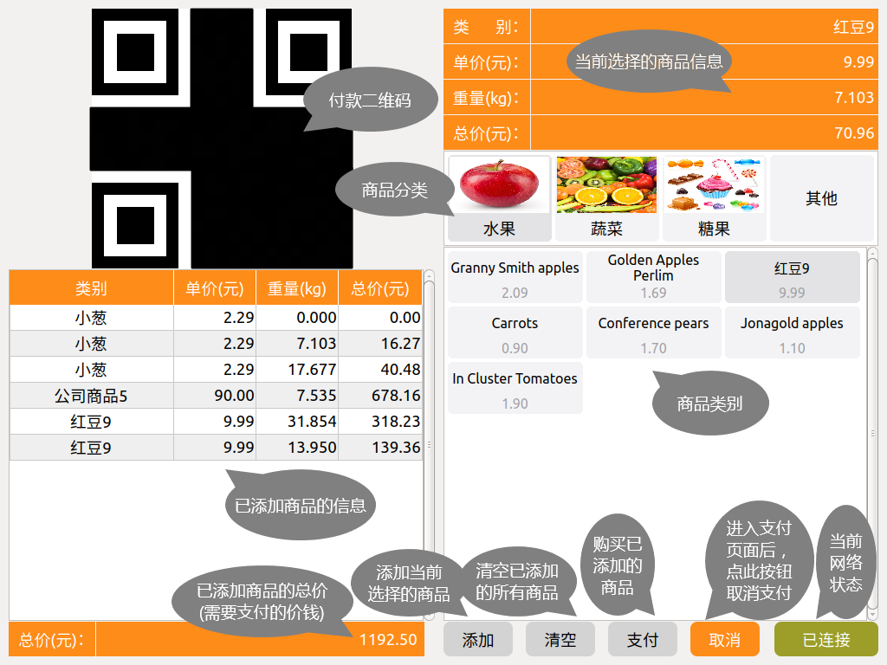

.. _skids-index:

电子秤操作界面
============================

电子秤界面介绍
----------------------------

电子秤使用步骤
----------------------------

	1. 将选购的商品放到电子秤上；
	
	2. 在界面①中选择选购的商品的分类，然后在界面②中选择商品的具体类别；
	
		.. image:: img/scales_02.png
	
	3. 待③处的重量值稳定后，点击④处的“添加”按钮，将商品信息添加到左侧界面⑤中，同时⑥处的总价也会同时更新；
	
		.. image:: img/scales_03.png
	
	4. 界面右下方的“清空”按钮，可以清空已添加的所有的商品信息（有弹窗提示）；
	
		.. image:: img/scales_04.png
	
	5. 添加完所有选购的商品后，点击界面右下角的“支付”按钮进行支付。点击支付按钮后，会在界面⑦处显示支付二维码，使用小程序扫描二维码，即可完成支付；
	
		.. image:: img/scales_05.png
	
	6. 若点击“支付”按钮后，想取消支付，可以点击界面右下角的“取消”按钮；
	
		.. image:: img/scales_06.png
	
	7. 若支付成功，会自动清空已添加的商品，若支付过程发生错误，会弹窗提示；
	
		.. image:: img/scales_07.png
	

