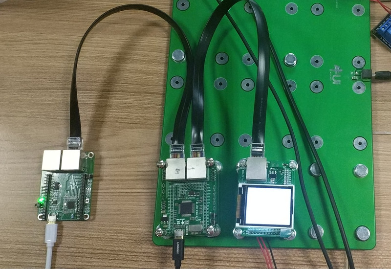
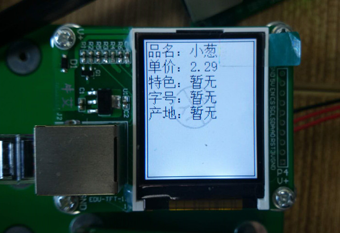

.. _use:

使用说明
============================

硬件连接
----------------------------

TB板J11-RJ48口连接ZigBee模块J3-RJ48口，TB板J12-RJ48口连接LCD模块RJ48口。

运行
----------------------------

TB板上运行"lcd.py""lcd_show.py""font.py"三个程序。

  + lcd.py：主程序
  + lcd_show.py：lcd驱动
  + font.py：字体库

服务器、网关相继开启后，再用USB线为ZigBee模块供电，然后用USB线将TB板连接至电脑，
打开uPyCraft工具，将以上三个程序下载到开发板中，然后运行"lcd.py"程序，
接着复位一下ZigBee（重新入网），在lcd上就会看到以下类似商品价签信息。

