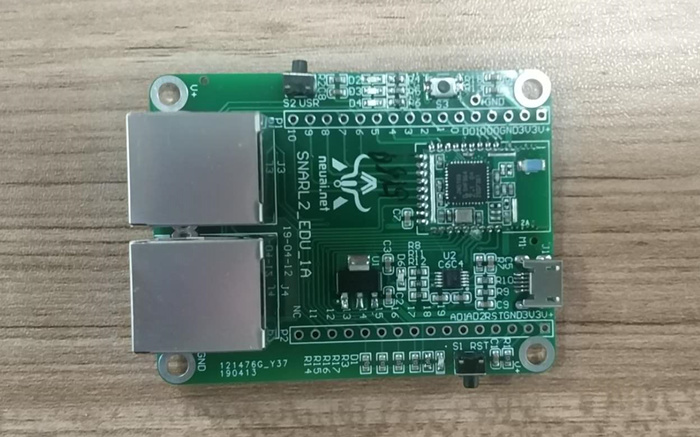
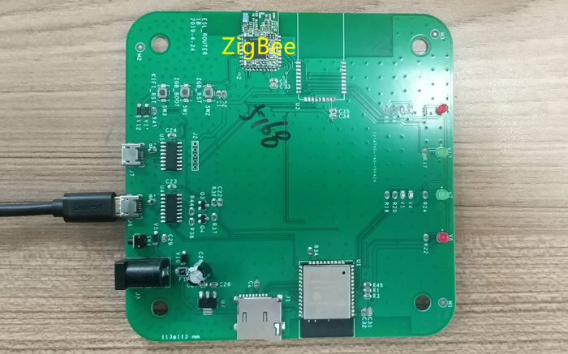
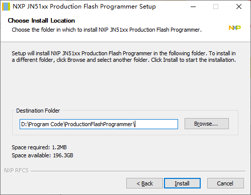
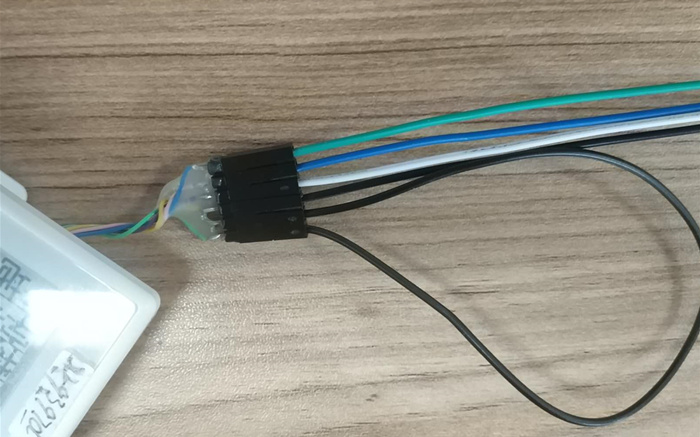

.. _burn:

固件烧写
============================

设备介绍
----------------------------

本教程中主要有三种ZigBee设备：

（1）带有墨水屏的ZigBee终端设备，需要烧写的固件为：EndDevice_JN5168.bin

.. image:: img/device1.jpg
    :alt: device
    :width: 540px

（2）带有AT指令的ZigBee终端设备，需要烧写的固件为：AT_EndDevice_JN516.bin

（3）ZigBee协调器，需要烧写的固件为：PAN_Coordinator_JN5168.bin

烧写工具
----------------------------

本教程中的所有ZigBee设备均采用JN-SW-4107工具烧写固件。
下载地址：https://www.nxp.com/cn/products/wireless/proprietary-ieee-802.15.4-based/zigbee/zigbee-3.0:ZIGBEE-3-0

下载后将其安装在自己容易找到的位置：

烧写方法
----------------------------

（1）将设备进入烧写模式（以EndDevice_JN5168.bin为例）：

（2）将固件拷贝到JN-SW-4107的安装目录下（D:\Program Code\ProductionFlashProgrammer）。

.. image:: img/burn3.png
    :alt: burn
    :width: 540px

（3）打开命令提示符，进入该目录，输入命令：JN51xxProgrammer.exe -s 端口号 -f 固件

.. image:: img/burn4.png
    :alt: burn
    :width: 540px

（4）等待烧写结束：

.. image:: img/burn5.png
    :alt: burn
    :width: 540px

